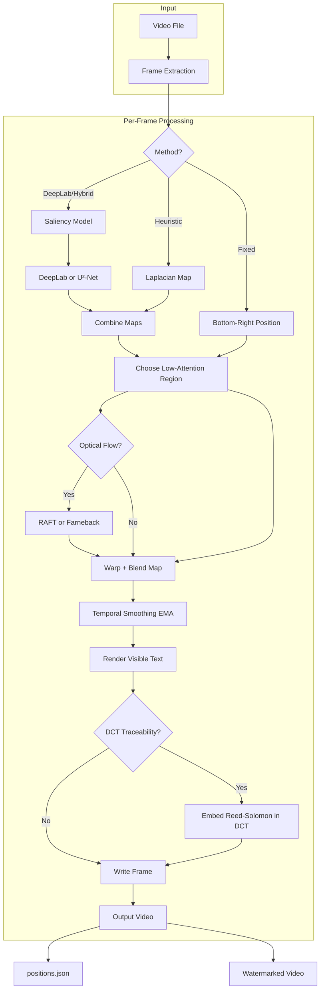
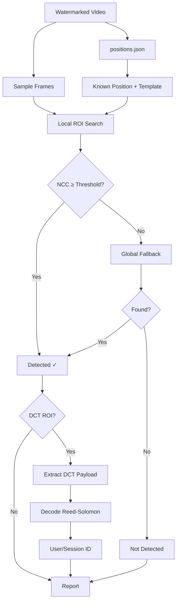
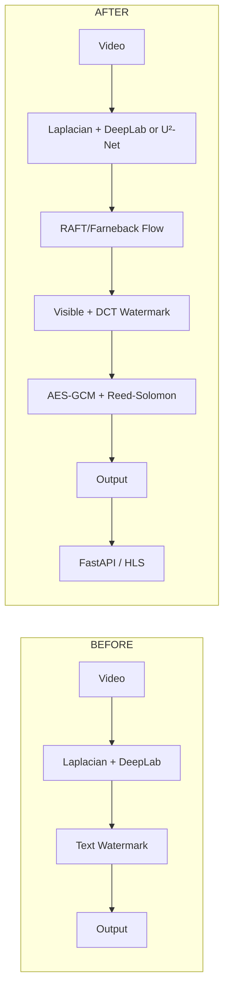
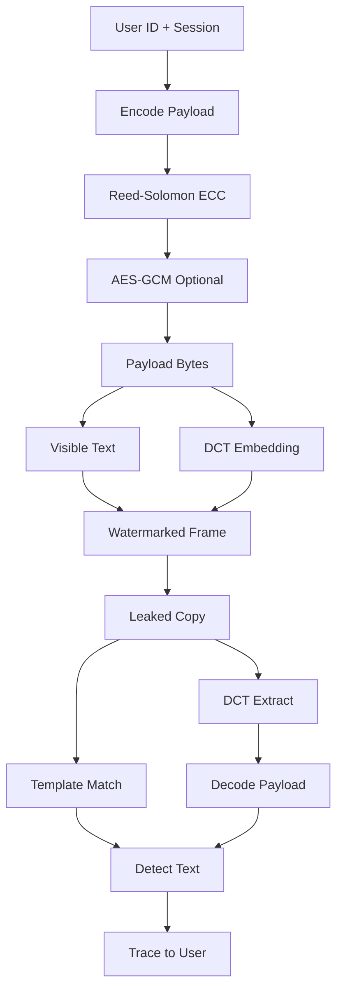

# VideoWaterMarker — Workflow & Flowchart

## Is Everything Done?

**Yes.** All proposal items are implemented:

| Component | Status |
|-----------|--------|
| U²-Net saliency | ✓ Implemented |
| RAFT optical flow | ✓ Implemented |
| DCT invisible watermark | ✓ Implemented |
| AES-GCM + Reed-Solomon | ✓ Implemented |
| FastAPI microservice | ✓ Implemented |
| Neural encoder-decoder | ✓ Implemented (training scaffold) |
| HLS/DASH segment watermarking | ✓ Implemented |
| BER evaluation | ✓ Implemented |
| Baseline comparison scaffold | ✓ Implemented |

**Optional / deployment:** VideoSeal/ItoV baselines need their repos cloned; neural model needs training on your data.

---

## High-Level Workflow (What Happens Now)

### 1. Watermarking Flow (Generate Tab)

```
Upload Video
    │
    ▼
┌─────────────────────────────────────────────────────────────────┐
│ FOR EACH FRAME:                                                  │
│                                                                  │
│  1. Compute placement map (where to put watermark)               │
│     • Laplacian complexity (edges)     → low = smooth = good    │
│     • DeepLab or U²-Net saliency      → low = background = good│
│     • Combine → pick lowest region (or edges)                   │
│                                                                  │
│  2. Optional: Optical flow (Farneback or RAFT)                   │
│     • Warp previous frame's map → smooth across time            │
│                                                                  │
│  3. Temporal smoothing (EMA)                                     │
│     • Avoid jitter between frames                                │
│                                                                  │
│  4. Embed watermarks:                                            │
│     a) Visible: Draw semi-transparent text (User ID)            │
│     b) Invisible (if traceability): DCT embed Reed-Solomon      │
│        payload in low-attention region                           │
│                                                                  │
│  5. Write frame → output video                                   │
│  6. Save positions.json (for detection later)                   │
└─────────────────────────────────────────────────────────────────┘
    │
    ▼
Watermarked Video + positions.json
```

### 2. Detection Flow (Detect Tab)

```
Upload: watermarked_video.mp4 + positions.json
    │
    ▼
FOR EACH SAMPLED FRAME:
    │
    ├─► Local ROI search (known position ± padding)
    │   • Multi-scale template matching (NCC)
    │   • Score ≥ threshold → detected
    │
    ├─► If failed: Global fallback
    │   • Search whole frame (downscaled)
    │   • Handles crop, rescale
    │
    └─► If DCT enabled: Extract invisible payload
        • Read Reed-Solomon bytes from DCT region
        • Decode user/session ID
    │
    ▼
Report: detection rate %, fingerprint text, DCT payload
```

### 3. Attack Test Flow

```
Watermarked video + positions
    │
    ▼
Apply selected attacks (blur, crop, reencode, noise, etc.)
    │
    ▼
Run detection on each attacked version
    │
    ▼
Compare detection rates → robustness report
```

---

## Before vs. After (What Changed)

### BEFORE (Original Project)

| Aspect | What It Had |
|--------|-------------|
| **Watermark type** | Visible text only |
| **Placement** | Laplacian + DeepLab (Hybrid) |
| **Saliency** | DeepLab only |
| **Optical flow** | Farneback only |
| **Payload** | Plain text / SHA256 hash |
| **Invisible watermark** | None |
| **Error correction** | None |
| **Deployment** | Streamlit app only |
| **Evaluation** | PSNR, SSIM, LPIPS, detection rate |
| **Streaming** | None |

### AFTER (Proposal-Aligned)

| Aspect | What It Has Now |
|--------|-----------------|
| **Watermark type** | Visible text + **invisible DCT** |
| **Placement** | Laplacian + DeepLab or **U²-Net** |
| **Saliency** | DeepLab or **U²-Net** |
| **Optical flow** | Farneback or **RAFT** |
| **Payload** | **AES-GCM** (optional) + **Reed-Solomon** |
| **Invisible watermark** | DCT in low-attention regions |
| **Error correction** | Reed-Solomon (survives attacks) |
| **Deployment** | Streamlit + **FastAPI microservice** |
| **Evaluation** | + **BER**, recovery accuracy |
| **Streaming** | **HLS segment watermarking** |
| **Neural** | **U-Net encoder-decoder** + training script |
| **Baselines** | **VideoSeal/ItoV comparison** scaffold |

---

## Flowcharts

### Flowchart 1: Main Watermarking Pipeline



### Flowchart 2: Detection Pipeline



### Flowchart 3: System Overview (Before vs After)



### Flowchart 4: Traceability Flow



---

## Quick Reference: Entry Points

| What You Want | Command / Action |
|---------------|------------------|
| Interactive app | `streamlit run src/app_watermark_ui.py` |
| API service | `uvicorn src.api_watermark:app --host 0.0.0.0 --port 8000` |
| CLI watermark | `python src/watermark_video.py --input v.mp4 --output out.mp4 --positions_out pos.json` |
| Train neural | `python -m src.neural_watermark.train --data_dir data/input` |
| HLS watermark | `python -m src.hls_watermark --manifest play.m3u8 --output out/` |
| Baseline compare | `python -m src.baselines.run_baseline_comparison --clean v.mp4 --ours out.mp4` |
